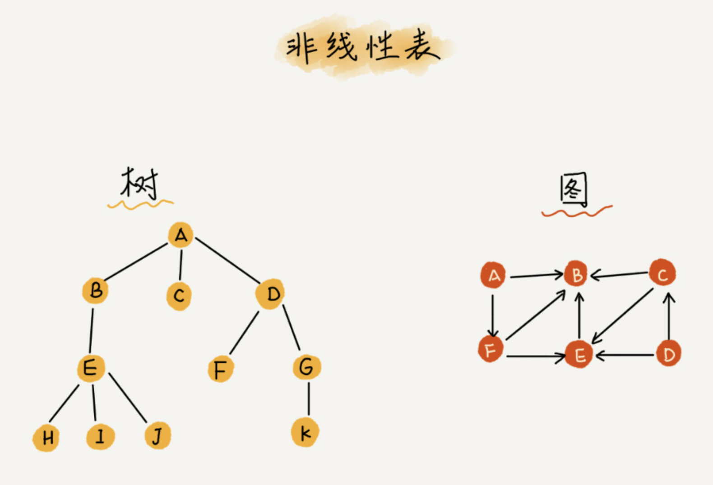
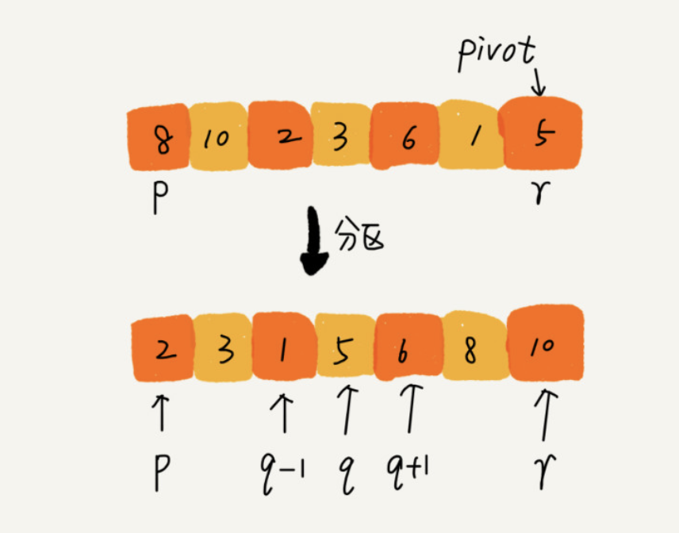
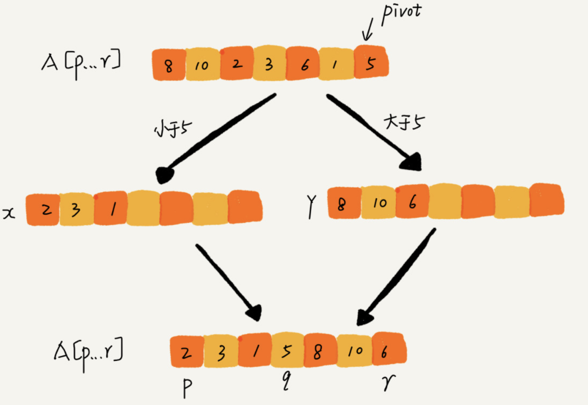
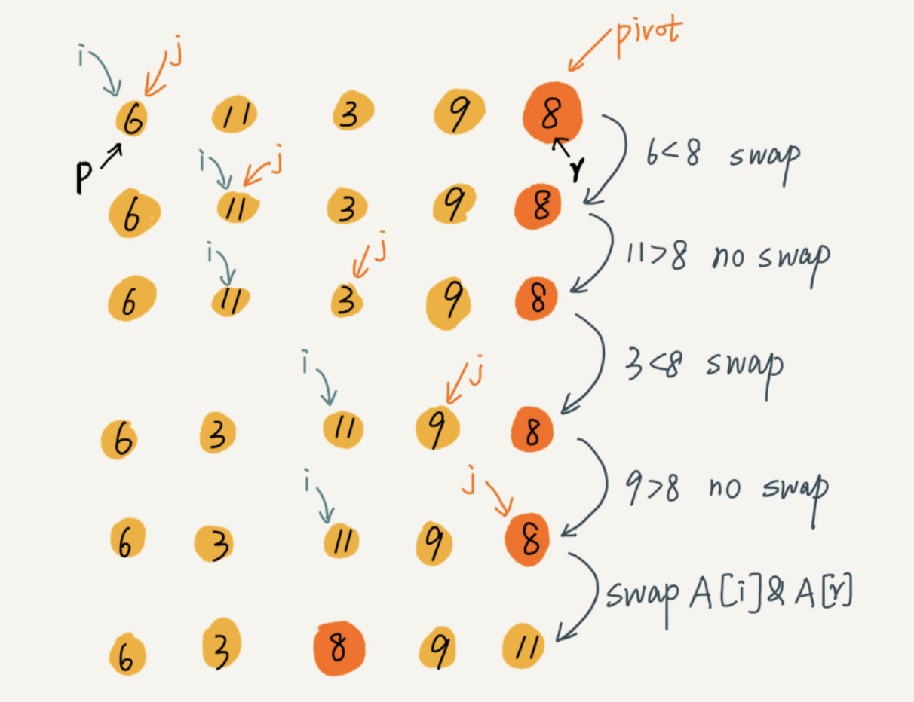

# 概述


数组（Array）是一种线性表数据结构。它用**一组连续的内存空存空间**，来**存储一组具有相同类型的数据**。




数组和链表的区别：链表适合插入和删除，时间复杂度 O(1)；数组适合查找，但是查找的时间复杂度并不为 O(1)，即便是排好序的数组，用二分查找，时间复杂度也为O(logn)。数组支持随机访问，根据下标随机访问的时间复杂度为 O(1)。数组的插入和删除操作非常低效，平均情况时间复杂度为 O(n)。

# 数组

# 链表

# 栈

# 队列

# 树

#### 1. 基本概念

树的高度（Height）、深度（Depth）、层（Level）：

* 节点的高度：节点到叶子节点的最长路径(边数)；

* 节点的深度：根节点到这个节点所经历的边的个数；

* 节点的层数：节点的深度+1

* 树的高度：根节点的高度


**满二叉树** ：叶子节点全都在最底层，除了叶子节点之外，每个节点都有左右两个子节点。

**完全二叉树**：叶子节点都在最底下两层，最后一层的叶子节点都靠左排列，并且除了最后一层，其他层的节点个数都要达到最大。


#### 2. 二叉树的遍历

二叉树的遍历分为三种：前序遍历、中序遍历和后序遍历。

- **前序遍历(Preorder Traversal )**：NLR（根左右），访问根结点的操作发生在遍历其左右子树之前。
- **中序遍历(Inorder Traversal)**：LNR（左根右），访问根结点的操作发生在遍历其左右子树之中（间）。
- **后序遍历(Postorder Traversal)**：LRN（左右根），访问根结点的操作发生在遍历其左右子树之后。


pseudocode：

```java
void preOrder(Node* root) {
  if (root == null) return;
  print root // 此处为伪代码，表示打印 root 节点
  preOrder(root->left);
  preOrder(root->right);
}

void inOrder(Node* root) {
  if (root == null) return;
  inOrder(root->left);
  print root // 此处为伪代码，表示打印 root 节点
  inOrder(root->right);
}

void postOrder(Node* root) {
  if (root == null) return;
  postOrder(root->left);
  postOrder(root->right);
  print root // 此处为伪代码，表示打印 root 节点
}

```

# 图

# 递归

递归需要满足的三个条件

1. 一个问题的解可以分解为几个子问题的解

2. 这个问题与分解之后的子问题，除了数据规模不同，求解思路完全一样

3. 存在递归终止条件

写递归代码最关键的是写出递推公式，找到终止条件，剩下将递推公式转化为代码就很简单了。

写递归代码的关键就是找到如何将大问题分解为小问题的规律，并且基于此写出递推公式，然后再推敲终止条件，最后将递推公式和终止条件翻译成代码。

# 排序

#### 1. [快速排序](https://www.geeksforgeeks.org/python-program-for-quicksort/)

Pseudo Code: 

```c++
/* low  --> Starting index,  high  --> Ending index */
quickSort(arr[], low, high)
{
    if (low < high)
    {
        /* pi is partitioning index, arr[pi] is now
           at right place */
        pi = partition(arr, low, high);
        quickSort(arr, low, pi - 1);  // Before pi
        quickSort(arr, pi + 1, high); // After pi
    }
}
```

以最后一个元素作为 pivot（分区点），比它大的放在其后，比它小的放在之前，然后递归。




partition具体过程（如果要申请额外空间）：

对于不申请额外空间的做法：

Pseudo Code: 

```C++
partition(A, p, r) {
  pivot = A[r]
  i = p
  for j = p to r-1 do {
    if A[j] < pivot {
      swap A[i] with A[j]
      i = i+1
    }
  }
  swap A[i] with A[r]
  return i
```

核心思想是，遍历pivot之前的元素，如果小于pivot则将元素与arr[i]互换（arr[i]之前表示已处理）。以下标i为分割点，i之前表示已经处理过，到最后一步互换arr[i]和pivot即可。在代码中需要要注意索引的位置。如下图：

```python
# Python program for implementation of Quicksort Sort

# This function takes last element as pivot, places
# the pivot element at its correct position in sorted
# array, and places all smaller (smaller than pivot)
# to left of pivot and all greater elements to right
# of pivot

def partition(arr, low, high):
    i = (low - 1)  # index of smaller element
    pivot = arr[high]  # pivot
    for j in range(low, high):
        # If current element is smaller than or equal to pivot
        if arr[j] <= pivot:
            # increment index of smaller element
            i = i + 1
            arr[i], arr[j] = arr[j], arr[i]
    arr[i + 1], arr[high] = arr[high], arr[i + 1]
    return (i + 1)

# The main function that implements QuickSort
# arr[] --> Array to be sorted,
# low --> Starting index,
# high --> Ending index

# Function to do Quick sort
def quickSort(arr, low, high):
    if low < high:
        # pi is partitioning index, arr[p] is now
        # at right place
        pi = partition(arr, low, high)
        # Separately sort elements before
        # partition and after partition
        quickSort(arr, low, pi - 1)
        quickSort(arr, pi + 1, high)

if __name__ == '__main__':
    # Driver code to test above
    arr = [8, 10, 2, 3, 6, 1, 5]
    n = len(arr)
    quickSort(arr, 0, n - 1)
    print("Sorted array is:")
    print(arr)
    # [1, 2, 3, 5, 6, 8, 10]
```

#### python实现的各种排序：

```python
# 方法一：内置的sort()和sorted()
# 方法二：快速排序
# -*- coding:utf-8 -*-
def quick_sort(lst):
    if not lst:
        return []
    pivot = lst[0]
    left = quick_sort([x for x in lst[1: ] if x < pivot])
    right = quick_sort([x for x in lst[1: ] if x >= pivot])
    return left + [pivot] + right

# 方法三：归并排序
# -*- coding:utf-8 -*-
def merge_sort(lst):
    if len(lst) <= 1:
        return lst
    mid = len(lst) // 2
    left = merge_sort(lst[: mid])
    right = merge_sort(lst[mid:])
    return merge(left, right)

def merge(left, right):
    l, r, res = 0, 0, []
    while l < len(left) and r < len(right):
        if left[l] <= right[r]:
            res.append(left[l])
            l += 1
        else:
            res.append(right[r])
            r += 1
    res += left[l:]
    res += right[r:]
    return res

# 方法四：堆排序
# -*- coding:utf-8 -*-
def siftup(lst, temp, begin, end):
    if lst == []:
        return []
    i, j = begin, begin * 2 + 1
    while j < end:
        if j + 1 < end and lst[j + 1] > lst[j]:
            j += 1
        elif temp > lst[j]:
            break
        else:
            lst[i] = lst[j]
            i, j = j, 2 * j + 1
    lst[i] = temp

def heap_sort(lst):
    if lst == []:
        return []
    end = len(lst)
    for i in range((end // 2) - 1, -1, -1):
        siftup(lst, lst[i], i, end)
    for i in range(end - 1, 0, -1):
        temp = lst[i]
        lst[i] = lst[0]
        siftup(lst, temp, 0, i)
    return lst
 
# 方法五：冒泡排序
# -*- coding:utf-8 -*-
def bubble_sort(lst):
    if lst == []:
        return []
    for i in range(len(lst)):
        for j in range(1, len(lst) - i):
            if lst[j-1] > lst[j]:
                lst[j-1], lst[j] = lst[j], lst[j-1]
    return lst

# 方法六：直接选择排序
# -*- coding:utf-8 -*-
def select_sort(lst):
    if lst == []:
        return []
    for i in range(len(lst)-1):
        smallest = i
        for j in range(i, len(lst)):
            if lst[j] < lst[smallest]:
                smallest = j
        lst[i], lst[smallest] = lst[smallest], lst[i] 
    return lst

# 方法七：插入排序
# -*- coding:utf-8 -*-
def Insert_sort(lst):
    if lst == []:
        return []
    for i in range(1, len(lst)):
        temp = lst[i]
        j = i
        while j > 0 and temp < lst[j - 1]:
            lst[j] = lst[j - 1]
            j -= 1
        lst[j] = temp
    return lst

```


# REFERENCE

* [什么是P问题、NP问题和NPC问题]([http://www.matrix67.com/blog/archives/105](http://www.matrix67.com/blog/archives/105))