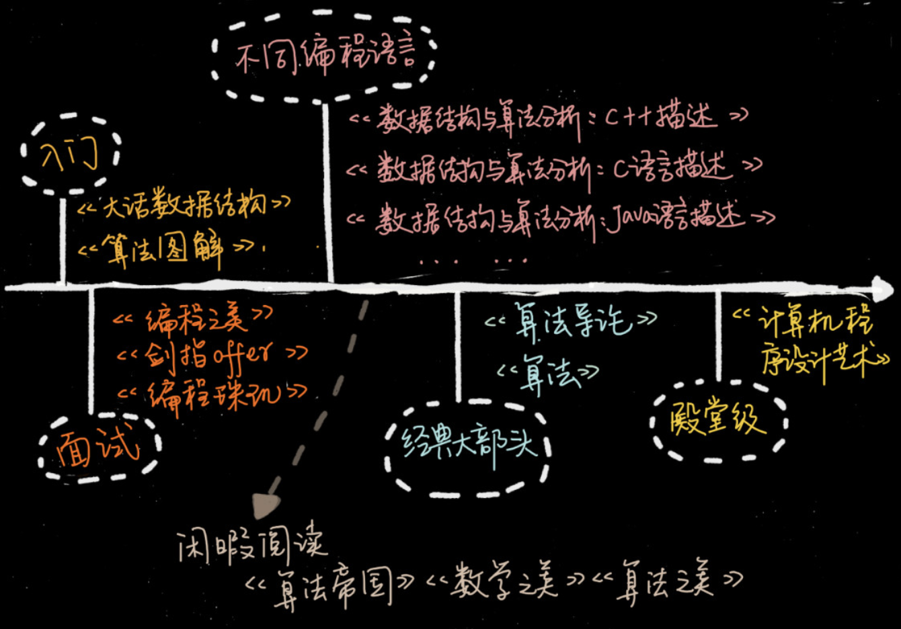
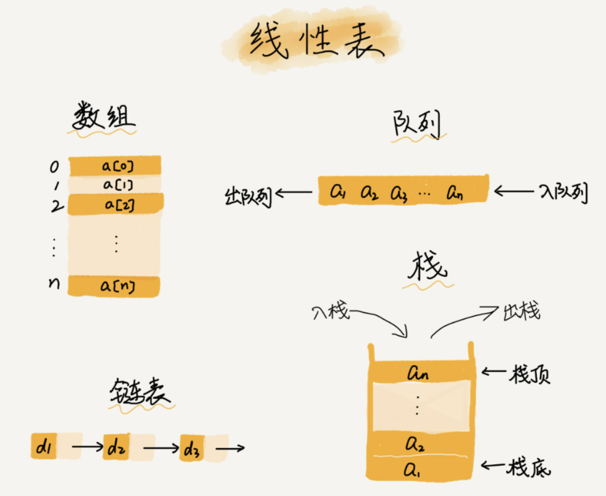

# 概述




数组（Array）是一种线性表数据结构。它用**一组连续的内存空存空间**，来**存储一组具有相同类型的数据**。




数组和链表的区别：链表适合插入和删除，时间复杂度 O(1)；数组适合查找，但是查找的时间复杂度并不为 O(1)，即便是排好序的数组，用二分查找，时间复杂度也为O(logn)。数组支持随机访问，根据下标随机访问的时间复杂度为 O(1)。数组的插入和删除操作非常低效，平均情况时间复杂度为 O(n)。

# 数组

# 链表

# 栈

# 队列

# 树

#### 1. 基本概念

树的高度（Height）、深度（Depth）、层（Level）：

* 节点的高度：节点到叶子节点的最长路径(边数)；

* 节点的深度：根节点到这个节点所经历的边的个数；

* 节点的层数：节点的深度+1

* 树的高度：根节点的高度


**满二叉树** ：叶子节点全都在最底层，除了叶子节点之外，每个节点都有左右两个子节点。

**完全二叉树**：叶子节点都在最底下两层，最后一层的叶子节点都靠左排列，并且除了最后一层，其他层的节点个数都要达到最大。


#### 2. 二叉树的遍历

二叉树的遍历分为三种：前序遍历、中序遍历和后序遍历。

- **前序遍历(Preorder Traversal )**：NLR（根左右），访问根结点的操作发生在遍历其左右子树之前。
- **中序遍历(Inorder Traversal)**：LNR（左根右），访问根结点的操作发生在遍历其左右子树之中（间）。
- **后序遍历(Postorder Traversal)**：LRN（左右根），访问根结点的操作发生在遍历其左右子树之后。


pseudocode：

```java
void preOrder(Node* root) {
  if (root == null) return;
  print root // 此处为伪代码，表示打印 root 节点
  preOrder(root->left);
  preOrder(root->right);
}

void inOrder(Node* root) {
  if (root == null) return;
  inOrder(root->left);
  print root // 此处为伪代码，表示打印 root 节点
  inOrder(root->right);
}

void postOrder(Node* root) {
  if (root == null) return;
  postOrder(root->left);
  postOrder(root->right);
  print root // 此处为伪代码，表示打印 root 节点
}

```

# 图

# 总结


# REFERENCE

* [什么是P问题、NP问题和NPC问题]([http://www.matrix67.com/blog/archives/105](http://www.matrix67.com/blog/archives/105))