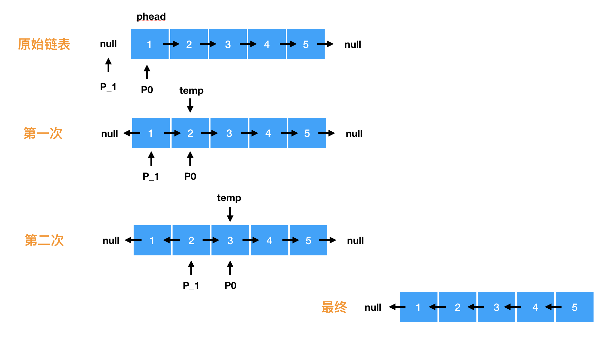
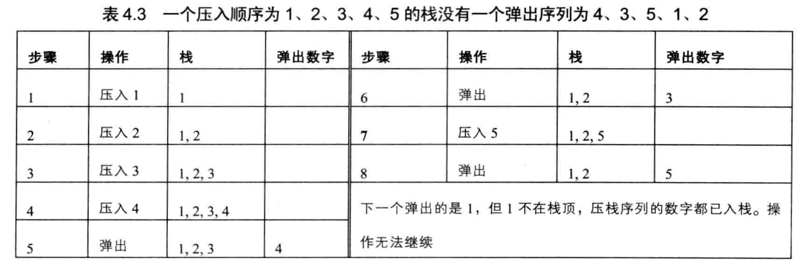
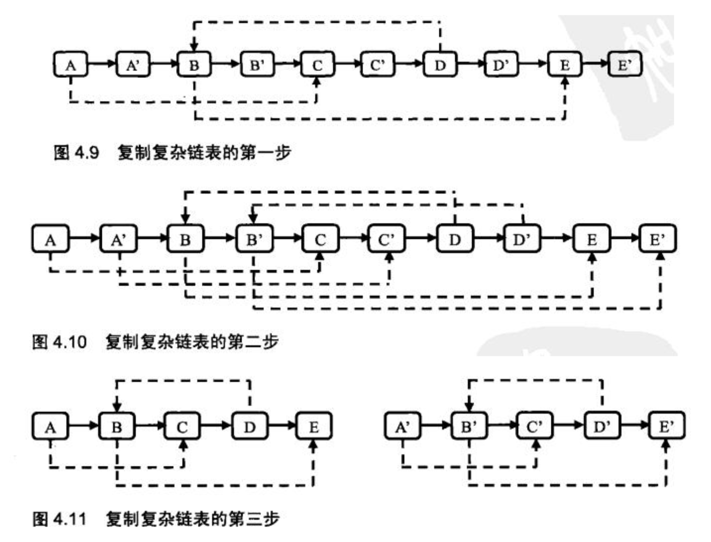

## Python first！！！

## THEN CPP ！！！

## Focus on ！！！

# 1. 二维数组中的查找

在一个二维数组中（每个一维数组的长度相同），每一行都按照从左到右递增的顺序排序，每一列都按照从上到下递增的顺序排序。请完成一个函数，输入这样的一个二维数组和一个整数，判断数组中是否含有该整数。

```python
# -*- coding:utf-8 -*-
class Solution:
    # array 二维列表
    def Find(self, target, array):
        # write code here
        for ii in array:
            for jj in ii:
                if target == jj:
                    return True
        return False     
```
# 2. 替换空格
请实现一个函数，将一个字符串中的每个空格替换成“%20”。例如，当字符串为We Are Happy.则经过替换之后的字符串为We%20Are%20Happy。

```python
# -*- coding:utf-8 -*-
class Solution:
    # s 源字符串
    def replaceSpace(self, s):
        # write code here
        raw = ''
        for i in list(s):
            if i ==' ':
                raw+= '%20'
            else:
                raw+=i
        return raw
```

# 3. 从尾到头打印链表
输入一个链表，按链表值从尾到头的顺序返回一个ArrayList。

```python
# -*- coding:utf-8 -*-
# class ListNode:
#     def __init__(self, x):
#         self.val = x
#         self.next = None

class Solution:
    # 返回从尾部到头部的列表值序列，例如[1,2,3]
    def printListFromTailToHead(self, listNode):
        # write code here
        l=[]
        while listNode:
            l.append(listNode.val)
            listNode=listNode.next
        return l[::-1]
```

# 4. 重建二叉树
输入某二叉树的前序遍历和中序遍历的结果，请重建出该二叉树。假设输入的前序遍历和中序遍历的结果中都不含重复的数字。例如输入前序遍历序列{1,2,4,7,3,5,6,8}和中序遍历序列{4,7,2,1,5,3,8,6}，则重建二叉树并返回。

解释：

- **前序遍历(Preorder Traversal )**：NLR（根左右），访问根结点的操作发生在遍历其左右子树之前。
- **中序遍历(Inorder Traversal)**：LNR（左根右），访问根结点的操作发生在遍历其左右子树之中（间）。
- **后序遍历(Postorder Traversal)**：LRN（左右根），访问根结点的操作发生在遍历其左右子树之后。


注意：由于被访问的结点必是某子树的根，所以**N(Node）**、**L(Left subtree）**和**R(Right subtree）**又可解释为根、根的左子树和根的右子树。NLR、LNR和LRN分别又称为先根遍历、中根遍历和后根遍历。


```python
# -*- coding:utf-8 -*-
# class TreeNode:
#     def __init__(self, x):
#         self.val = x
#         self.left = None
#         self.right = None
class Solution:
    # 返回构造的TreeNode根节点
    def reConstructBinaryTree(self, pre, tin):
        # write code here
        if not pre or not tin:
            return None
        root = TreeNode(pre.pop(0))
        index = tin.index(root.val)
        root.left = self.reConstructBinaryTree(pre, tin[:index])
        root.right = self.reConstructBinaryTree(pre, tin[index + 1:])
        return root

```

# 5. 用两个栈实现队列

用两个栈来实现一个队列，完成队列的Push和Pop操作。 队列中的元素为int类型。

解释：
1.栈(stacks)是一种只能通过访问其一端来实现数据存储与检索的线性数据结构，具有后进先出(last in first out，LIFO)的特征。python列表方法使得列表作为堆栈非常容易，最后一个插入，最先取出（“后进先出”）。要添加一个元素到堆栈的顶端，使用`append()` 。要从堆栈顶部取出一个元素，使用 `pop()` ，不用指定索引。

```python
>>> stack = [3, 4, 5]
>>> stack.append(6)
>>> stack.append(7)
>>> stack
[3, 4, 5, 6, 7]
>>> stack.pop()
7
>>> stack
[3, 4, 5, 6]
>>> stack.pop()
6
>>> stack.pop()
5
>>> stack
[3, 4]
```
2.队列(queue)是一种具有先进先出特征的线性数据结构，元素的增加只能在一端进行，元素的删除只能在另一端进行。能够增加元素的队列一端称为队尾，可以删除元素的队列一端则称为队首。

列表也可以用作队列，其中先添加的元素被最先取出 (“先进先出”)；然而列表用作这个目的相当低效。因为在列表的末尾添加和弹出元素非常快，但是在列表的开头插入或弹出元素却很慢 (因为所有的其他元素都必须移动一位)。

若要实现一个队列， `collections.deque` 被设计用于快速地从两端操作。

```python
>>> from collections import deque
>>> queue = deque(["Eric", "John", "Michael"])
>>> queue.append("Terry")           # Terry arrives
>>> queue.append("Graham")          # Graham arrives
>>> queue.popleft()                 # The first to arrive now leaves
'Eric'
>>> queue.popleft()                 # The second to arrive now leaves
'John'
>>> queue                           # Remaining queue in order of arrival
deque(['Michael', 'Terry', 'Graham'])
```

```python
class Solution:
    def __init__(self):
        self.stack1 = []
        self.stack2 = []
    def push(self, node):
        self.stack1.append(node)
    def pop(self):
        if not self.stack2:
            while self.stack1:
                self.stack2.append(self.stack1.pop())
        return self.stack2.pop()
```

# 6. 旋转数组的最小数字
把一个数组最开始的若干个元素搬到数组的末尾，我们称之为数组的旋转。 输入一个非递减排序的数组的一个旋转，输出旋转数组的最小元素。 例如数组{3,4,5,1,2}为{1,2,3,4,5}的一个旋转，该数组的最小值为1。 NOTE：给出的所有元素都大于0，若数组大小为0，请返回0。

```python
class Solution:
    def minNumberInRotateArray(self, rotateArray):
        if not rotateArray:
            return 0
        else:
            max_a = max(rotateArray)
            index_a = rotateArray.index(max_a)
            for i in range(index_a+1,len(rotateArray)):
                if rotateArray[i]==max_a:
                    continue
                else:
                    return rotateArray[i]
```

```python
# 二分排序解法：
class Solution:
    def minNumberInRotateArray(self, rotateArray):
        if len(rotateArray) == 0:
            return 0
        left = 0
        right = len(rotateArray) - 1
        mid = 0
        while rotateArray[left] >= rotateArray[right]:
            if right - left == 1:
                mid = right
                break
            mid = left + (right - left) // 2
            if rotateArray[left] == rotateArray[mid] and rotateArray[mid] == rotateArray[right]:
                return self.minInorder(rotateArray, left, right)
            if rotateArray[mid] >= rotateArray[left]:
                left = mid
            else:
                right = mid
        return rotateArray[mid]
    
    def minInorder(self, array, left, right):
        result = array[left]
        for i in range(left+1, right+1):
            if array[i] < result:
                result = array[i]
        return result
```
# 7. 斐波那契数列

大家都知道斐波那契数列，现在要求输入一个整数n，请你输出斐波那契数列的第n项（从0开始，第0项为0），n<=39

思路：用循环不用递归，很容易Stack Overflow.
- Python
```python
class Solution:
    def Fibonacci(self, n):
        res=[0,1,1,2]
        while len(res)<=n:
            res.append(res[-1]+res[-2])
        return res[n]
#########################################
class Solution:
    def Fibonacci(self, n):
        # write code here
        if n <= 1:
            return n
        first, second, third = 0, 1, 0
        for i in range(2, n+1):
            third = first + second
            first = second
            second = third
        return third
```
- C++
```cpp
class Solution {
public:
    int Fibonacci(int n) {
        int f = 0, g = 1;
        while(n--) {
            g += f;
            f = g - f;
        }
        return f;
    }
};
/////////////////////////////////////////////
class Solution {
public:
    int Fibonacci(int n) {
        if(n <= 0)
            return 0;
        if(n == 1)
            return 1;
        int first = 0, second = 1, third = 0;
        for (int i = 2; i <= n; i++) {
            third = first + second;
            first = second;
            second = third;
        }
        return third;
    }
};
```
# 8. 跳台阶
一只青蛙一次可以跳上1级台阶，也可以跳上2级。求该青蛙跳上一个n级的台阶总共有多少种跳法（先后次序不同算不同的结果）。

思路：假设有n个台阶，跳法为f(n)。n=1时，f(n)=1，n=2时，f(n)=1，n>2时，如果第一次跳1级，剩余的有f(n-1)种跳法，如果第一次跳2级，剩余的有f(n-2)种跳法，可见这就是个斐波那契问题。
- Python
```python
# -*- coding:utf-8 -*-
class Solution:
    def jumpFloor(self, number):
        a,b=0,1
        while number > 0:
            c=a+b 
            a,b=b,c 
            number-=1
        return c
```
- C++
```cpp
class Solution {
public:
    int jumpFloor(int n) {
        int f=1,g=2;
        n--;
        while(n--)
        {
            g+=f;
            f=g-f;
        }
        return f;
    }
};
//////////////////////////////
class Solution {
public:
    int jumpFloor(int number) {
        if(number<4){
            return number;
        }
        int a=2, b=3, c=0;
        for(int i=4;i<=number;i++){
            c=a+b;
            a=b; 
            b=c; 
        }
        return c;
    }
};

```
# 9. 变态跳台阶

一只青蛙一次可以跳上1级台阶，也可以跳上2级……它也可以跳上n级。求该青蛙跳上一个n级的台阶总共有多少种跳法。

思路：
- f(0) = 0
- f(1) = 1
- f(2) = f(2-1) + f(2-2)         # f(2-2) 表示2阶一次跳2阶的次数。
- f(3) = f(3-1) + f(3-2) + f(3-3) 
- ...
- f(n-1) = f(n-2) + f(n-3) + ... + f(n-(n-1)) + f(n-n) 
- f(n) = f(n-1) + f(n-2) + f(n-3) + ... + f(n-(n-1)) + f(n-n) 

f(n)表示n级台阶的跳法，如果第一次跳1级，剩下则有f(n-1)种跳法，如果第一次跳2级，则有f(n-2)种跳法，... ，如果第一次跳n级，就跳完了。
归纳可得：

 f(n) = 2*f(n-1) = 2^(n-1)

```python
# -*- coding:utf-8 -*-
class Solution:
    def jumpFloorII(self, number):
        return 2**(number-1)
```

# 10. 矩形覆盖

我们可以用2\*1的小矩形横着或者竖着去覆盖更大的矩形。请问用n个2*1的小矩形无重叠地覆盖一个2*n的大矩形，总共有多少种方法？

思路：同样也是斐波那契数列问题，第一个位置可以横着放，也可以竖着放，对应剩下的位置分别有f(n-1)和f(n-2)种放法。则f(n)=f(n-1)+f(n-2)

```cpp
class Solution {
public:
    int rectCover(int number) {
        if(number<=3){
            return number;
        }
        int fn_2=2,fn_1=3,fn=0;
        while(number>3){
            fn=fn_1+fn_2;
            fn_2=fn_1;
            fn_1=fn;
            number--;
        }
        return fn;
    }
};
```

# 11. 二进制中1的个数
输入一个整数，输出该数二进制表示中1的个数。其中负数用补码表示。

如果一个整数不为0，那么这个整数至少有一位是1。如果我们把这个整数减1，那么原来处在整数最右边的1就会变为0，原来在1后面的所有的0都会变成1(如果最右边的1后面还有0的话)。其余所有位将不会受到影响。

举个例子：一个二进制数1100，从右边数起第三位是处于最右边的一个1。减去1后，第三位变成0，它后面的两位0变成了1，而前面的1保持不变，因此得到的结果是1011.我们发现减1的结果是把最右边的一个1开始的所有位都取反了。这个时候如果我们再把原来的整数和减去1之后的结果做与运算，从原来整数最右边一个1那一位开始所有位都会变成0。如1100&1011=1000.也就是说，把一个整数减去1，再和原整数做与运算，会把该整数最右边一个1变成0.那么一个整数的二进制有多少个1，就可以进行多少次这样的操作。

在Python中，由于负数使用补码表示的，对于负数，最高位为1，而负数在计算机是以补码存在的，往右移，符号位不变，符号位1往右移，最终可能会出现全1的情况，导致死循环。与0xffffffff相与，就可以消除负数的影响。

```python
# -*- coding:utf-8 -*-
class Solution:
    def NumberOf1(self, n):
        # write code here
        count = 0
        if n<0:
            n = n & 0xffffffff
        while n:
            count += 1
            n = n & (n-1)
        return count
```

# 12. 数值的整数次方
给定一个double类型的浮点数base和int类型的整数exponent。求base的exponent次方。

需要对base和exponent分情况讨论：
如果base为0，exponent<=0会报错；
其他情况需要讨论exponent的正负。

由于计算机中表示小数（float和double）都会有误差，我们不能直接用==来判断它们是否相等，可以通过比较它们之间的差的绝对值是否为一个极小值（如0.0000001）来判断它们是否相等。但是python中的等于没有误差，可以直接使用：
```python
class Solution:
    def Power(self, base, exponent):
        flag = 0
        result = 1
        if (base == 0) & (exponent<=0) :
            return False
        if exponent < 0:
            flag = 1
        for i in range(abs(exponent)):
            result *= base
        if flag == 1:
            result = 1 / result
        return result
```

# 13. 调整数组顺序使奇数位于偶数前面

输入一个整数数组，实现一个函数来调整该数组中数字的顺序，使得所有的奇数位于数组的前半部分，所有的偶数位于数组的后半部分，并保证奇数和奇数，偶数和偶数之间的相对位置不变。

python常规解法1，利用两个列表来存储奇数和偶数，然后再拼接：
```python
class Solution:
    def reOrderArray(self, array):
        odd_lst=[]
        even_lst=[]
        for ele in array:
            if ele%2==0:
                even_lst.append(ele)
            else:
                odd_lst.append(ele)
        final_arr = odd_lst+even_lst
        return final_arr

# 简洁版：
def reOrderArray(self, array):
        # write code here
        odd,even=[],[]
        for i in array:
            odd.append(i) if i%2==1 else even.append(i)
        return odd+even
```
python常规解法2，从后往前遍历奇数，从前往后遍历偶数，然后利用双向队列来存储：
```python
from collections import deque
class Solution:
    def reOrderArray(self, array):
        odd = deque()
        l = len(array)
        for i in range(l):
            if array[-i-1] % 2 != 0:
                odd.appendleft(array[-i-1])
            if array[i] % 2 == 0:
                odd.append(array[i])
        return list(odd)
```
当然也可以用列表来存储，利用insert方法将后向遍历的奇数插到列表的开头。
```python
# -*- coding:utf-8 -*-
class Solution:
    def reOrderArray(self, array):
        res = []
        l = len(array)
        for i in range(l):
            if array[-i-1] % 2 != 0:
                res.insert(0,array[-i-1])
            if array[i] % 2 == 0:
                res.append(array[i])
        return res
```
python解法3，不开辟新空间：
```python
# -*- coding:utf-8 -*-
class Solution:
    def reOrderArray(self, array):
        # write code here
        boarder = -1
        for idx in range(len(array)):
            if array[idx] % 2:
                boarder += 1
                array.insert(boarder, array.pop(idx))
        return array

# 用sorted()结合key参数：
# -*- coding:utf-8 -*-
class Solution:
    def reOrderArray(self, array):
        # write code here
        return sorted(array,key=lambda c:c%2,reverse=True)
```

# 14. 链表中倒数第k个结点
输入一个链表，输出该链表中倒数第k个结点。

思路：利用两个指针，让它们之间的距离为k，则当前面的指针到达末尾时候，另一个指针对应的即为倒数第k个节点。但是注意要考虑好各种边界条件。

```python
class Solution:
    def FindKthToTail(self, head, k):
        if (head is None) or (k == 0):
            return None
        a = head
        b = head
        for i in range(k-1):
            if a.next is None:
                return None
            else:
                a = a.next
        while (a.next is not None):
            a = a.next
            b = b.next
        return b
```
另外一种用列表开辟新空间的做法：
```python
class Solution:
    def FindKthToTail(self, head, k):
        res=[]
        while head:
            res.append(head)
            head=head.next
        if k>len(res) or k<1:
            return
        return res[-k]
```


# 15. 反转链表

输入一个链表，反转链表后，输出新链表的表头。

```python
# -*- coding:utf-8 -*-
# class ListNode:
#     def __init__(self, x):
#         self.val = x
#         self.next = None
class Solution:
    def ReverseList(self, pHead):
        if (pHead is None) or (pHead.next is None):
            return pHead
        p_1 = None
        p0 = pHead
        while (p0 is not None):
            tmp = p0.next
            p0.next = p_1
            p_1 = p0
            p0 = tmp
        return p_1
```



# 16. 合并两个排序的链表

输入两个单调递增的链表，输出两个链表合成后的链表，当然我们需要合成后的链表满足单调不减规则。

递归版本：

```python
# -*- coding:utf-8 -*-
# class ListNode:
#     def __init__(self, x):
#         self.val = x
#         self.next = None
class Solution:
    # 返回合并后列表
    def Merge(self, pHead1, pHead2):
        if pHead1 is None:
            return pHead2
        if pHead2 is None:
            return pHead1
        pMerged = None
        if pHead1.val < pHead2.val:
            pMerged = pHead1
            pMerged.next = self.Merge(pHead1.next, pHead2)
        else:
            pMerged = pHead2
            pMerged.next = self.Merge(pHead1, pHead2.next)
        return pMerged
```

非递归版本：

```python
# -*- coding:utf-8 -*-
# class ListNode:
#     def __init__(self, x):
#         self.val = x
#         self.next = None
class Solution:
    # 返回合并后列表
    def Merge(self, pHead1, pHead2):
        pMerged = ListNode(0)
        pHead = pMerged
        while (pHead1 is not None) and (pHead2 is not None):
            if pHead1.val >= pHead2.val:
                pMerged.next = pHead2
                pHead2 = pHead2.next
            else:
                pMerged.next = pHead1
                pHead1 = pHead1.next
            pMerged = pMerged.next
        if (pHead1 is not None):
            pMerged.next = pHead1
        else:
            pMerged.next = pHead2 
        return pHead.next
```

# 17. 树的子结构

输入两棵二叉树A，B，判断B是不是A的子结构。（ps：我们约定空树不是任意一个树的子结构）

思路：可以分为两个步骤，首先在A树中寻找有无与B树根节点值相等的节点，如果有，则判断A树中以该节点为根节点的树是不是包含和B树一样的结构。

```python
# -*- coding:utf-8 -*-
# class TreeNode:
#     def __init__(self, x):
#         self.val = x
#         self.left = None
#         self.right = None
class Solution:
    def HasSubtree(self, pRoot1, pRoot2):
        if (pRoot1 is None) or (pRoot2 is None):
            return False
        return self.HasSubtree(pRoot1.left, pRoot2) or self.HasSubtree(pRoot1.right, pRoot2) or self.is_subtree(pRoot1, pRoot2)
    def is_subtree(self, A, B):
        if (B is None):
            return True
        if (A is None) or (A.val != B.val):
            return False
        return self.is_subtree(A.left, B.left) and self.is_subtree(A.right, B.right)
```

# 18. 二叉树的镜像

操作给定的二叉树，将其变换为源二叉树的镜像。

思路：还是用递归，依次对每个非叶节点进行翻转。

```python
class Solution:
    # 返回镜像树的根节点
    def Mirror(self, root):
        if (root is None or (root.left is None and root.right is None)):
            return None
        temp = root.left
        root.left = root.right
        root.right = temp
        if root.left is not None:
            self.Mirror(root.left)
        if root.right is not None:
            self.Mirror(root.right)
```

# 19. 顺时针打印矩阵

输入一个矩阵，按照从外向里以顺时针的顺序依次打印出每一个数字，例如，如果输入如下4 X 4矩阵： 1 2 3 4 5 6 7 8 9 10 11 12 13 14 15 16 则依次打印出数字1,2,3,4,8,12,16,15,14,13,9,5,6,7,11,10.

```python
class Solution:

    def printMatrix(self, matrix):
        res = []
        while matrix:
            res += matrix.pop(0)
            if matrix and matrix[0]: # 一定要记得判断 matrix[0]，否则在第二轮循环的时候会漏判[[],[]]
                for row in matrix:
                    res.append(row.pop())
            if matrix:
                res += matrix.pop()[::-1]
            if matrix and matrix[0]:
                for row in matrix[::-1]:
                    res.append(row.pop(0))
        return res
```

也可以循环遍历：

```python
# -*- coding:utf-8 -*-
class Solution:
    # matrix类型为二维列表，需要返回列表
    def printMatrix(self, matrix):
        # write code here
        rows = len(matrix)
        cols = len(matrix[0])
        result = []
        if rows == 0 and cols == 0:
            return result
        left, right, top, buttom = 0, cols - 1, 0, rows - 1
        while left <= right and top <= buttom:
            for i in range(left, right+1):
                result.append(matrix[top][i])
            for i in range(top+1, buttom+1):
                result.append(matrix[i][right])
            if top != buttom:
                for i in range(left, right)[::-1]:
                    result.append(matrix[buttom][i])
            if left != right:
                for i in range(top+1, buttom)[::-1]:
                    result.append(matrix[i][left])
            left += 1
            top += 1
            right -= 1
            buttom -= 1
        return result
```

# 20. 包含min函数的栈
定义栈的数据结构，请在该类型中实现一个能够得到栈中所含最小元素的min函数（时间复杂度应为O（1））。

思路：定义两个栈stack和min_stack，一个存储所有元素，一个存储最小值。
```python
# -*- coding:utf-8 -*-
class Solution:
    def __init__(self):
        self.stack = []
        self.min_stack = []
         
    def push(self, node):
        min = self.min()
        if not min or node < min:
            self.min_stack.append(node)
        else:
            self.min_stack.append(min)
        self.stack.append(node)
         
    def pop(self):
        if self.stack:
            self.min_stack.pop()
            return self.stack.pop()
     
    def top(self):
        # write code here
        if self.stack:
            return self.stack[-1]
         
    def min(self):
        # write code here
        if self.min_stack:
            return self.min_stack[-1]

```

# 21. 栈的压入、弹出序列
输入两个整数序列，第一个序列表示栈的压入顺序，请判断第二个序列是否可能为该栈的弹出顺序。假设压入栈的所有数字均不相等。例如序列1,2,3,4,5是某栈的压入顺序，序列4,5,3,2,1是该压栈序列对应的一个弹出序列，但4,3,5,1,2就不可能是该压栈序列的弹出序列。（注意：这两个序列的长度是相等的）
```python
# -*- coding:utf-8 -*-
class Solution:
    def IsPopOrder(self, pushV, popV):
        # write code here
        stack_ = []
        for i in pushV:
            stack_.append(i)
            while stack_ and stack_[-1] == popV[0]:
                stack_.pop()
                popV.pop(0)
        if stack_:
            return False
        return True
```




```python
# -*- coding:utf-8 -*-
class Solution:
 
    def IsPopOrder(self, pushV, popV):
        # stack中存入pushV中取出的数据
        stack=[]
        while popV:
            # 如果第一个元素相等，直接都弹出，根本不用压入stack
            if pushV and popV[0]==pushV[0]:
                popV.pop(0)
                pushV.pop(0)
            #如果stack的最后一个元素与popV中第一个元素相等，将两个元素都弹出
            elif stack and stack[-1]==popV[0]:
                stack.pop()
                popV.pop(0)
            # 如果pushV中有数据，压入stack
            elif pushV:
                stack.append(pushV.pop(0))
            # 上面情况都不满足，直接返回false。
            else:
                return False
        return True
```

# 22. 从上往下打印二叉树

从上往下打印出二叉树的每个节点，同层节点从左至右打印。

思路：其实就是广度优先遍历二叉树。可以借助于一个队列实现。每次打印一个节点，并判断该节点的左右节点是否存在，如果存在则将它们依次放入队列的尾部，并从队列的头部开始重复上述操作。

不论是广度优先遍历一个有向图还是一棵树，都要用到队列。首先把起始节点(根节点)放入队列，接下来每次从队列的头部取出一个节点，遍历该节点后把这个节点都能到达的节点（子节点）依次放入队列，重复该过程直到队列中的所有节点都被遍历为止。

```python
# -*- coding:utf-8 -*-
# class TreeNode:
#     def __init__(self, x):
#         self.val = x
#         self.left = None
#         self.right = None
class Solution:
    # 返回从上到下每个节点值列表，例：[1,2,3]
    def PrintFromTopToBottom(self, root):
        # write code here
        result = []
        if root is None:
            return result
        queue = [root]
        while queue:
            cur = queue.pop(0)
            result.append(cur.val)
            if cur.left:
                queue.append(cur.left)
            if cur.right:
                queue.append(cur.right)
        return result
    
```

# 23. 二叉搜索树的后序遍历序列

输入一个整数数组，判断该数组是不是某二叉搜索树的后序遍历的结果。如果是则输出Yes,否则输出No。假设输入的数组的任意两个数字都互不相同。

思路：

> 二叉查找树（Binary Search Tree），（又：二叉搜索树，二叉排序树）它或者是一棵空树，或者是具有下列性质的二叉树： 若它的左子树不空，则左子树上所有结点的值均小于它的根结点的值； 若它的右子树不空，则右子树上所有结点的值均大于它的根结点的值； 它的左、右子树也分别为二叉排序树。          
>
> --baidu百科

二叉搜索树的后序遍历序列中，最后一个数字是树的根节点 ，数组中前面的数字可以分为两部分：第一部分是左子树节点 的值，都比根节点的值小；第二部分是右子树节点的值，都比根节点的值大，可用递归分别判断前后两部分是否符合以上原则。

```python

# -*- coding:utf-8 -*-
class Solution:
    def VerifySquenceOfBST(self, sequence):
        # write code here
        if not len(sequence):
            return False
        if len(sequence) == 1:
            return True
        length = len(sequence)
        # 最后一个是根节点
        root = sequence[-1]
        i = 0
        # 遍历序列，寻找左右子树分界点
        while sequence[i] < root:
            i = i + 1
        k = i # 右树的起点
        # 根节点右侧子树应该都比根节点值大，如果小则返回False
        for j in range(i, length-1):
            if sequence[j] < root: 
                return False
        left_tree_s = sequence[:k] # 左树序列
        right_tree_s = sequence[k:length-1] # 右树序列
        left, right = True, True
        if len(left_tree_s) > 0:
            left = self.VerifySquenceOfBST(left_tree_s)
        if len(right_tree_s) > 0:
            right = self.VerifySquenceOfBST(right_tree_s)
        return left and right

```

```python
class Solution:
    def VerifySquenceOfBST(self, sequence):
        # write code here
        if sequence is None or len(sequence)==0:
            return False
        length=len(sequence)
        root=sequence[-1]
        # 在二叉搜索 树中 左子树节点小于根节点
        for i in range(length):
            if sequence[i]>root:
                break
        # 二叉搜索树中右子树的节点都大于根节点
        for j  in range(i,length):
            if sequence[j]<root:
                return False
        # 判断左子树是否为二叉树
        left=True
        if  i>0:
            left=self.VerifySquenceOfBST(sequence[0:i])
        # 判断 右子树是否为二叉树
        right=True
        if i<length-1:
            right=self.VerifySquenceOfBST(sequence[i:-1])
        return left and right
```

# ?24. 二叉树中和为某一值的路径

输入一颗二叉树的跟节点和一个整数，打印出二叉树中结点值的和为输入整数的所有路径。路径定义为从树的根结点开始往下一直到叶结点所经过的结点形成一条路径。(注意: 在返回值的list中，数组长度大的数组靠前)

```python
# -*- coding:utf-8 -*-
# class TreeNode:
#     def __init__(self, x):
#         self.val = x
#         self.left = None
#         self.right = None
class Solution:
    # 返回二维列表，内部每个列表表示找到的路径
    def FindPath(self, root, expectNumber):
        # write code here
        if root is None:
            return []
        if (root.left is None) and (root.right is None) and (expectNumber == root.val):
            return [[root.val]]
        result = []
        left = self.FindPath(root.left, expectNumber-root.val)
        right = self.FindPath(root.right, expectNumber-root.val)
        for i in left+right:
            result.append([root.val]+i)
        return result
```

```python
# -*- coding:utf-8 -*-
# class TreeNode:
#     def __init__(self, x):
#         self.val = x
#         self.left = None
#         self.right = None
class Solution:
    # 返回二维列表，内部每个列表表示找到的路径
    def FindPath(self, root, expectNumber):
        # write code here
        if not root:
            return []
        result = []
        def FindPathMain(root, path, currentSum):
            currentSum += root.val
            path.append(root)
            isLeaf = (root.left is None) and (root.right is None)
            if (currentSum == expectNumber) and isLeaf:
                onePath = []
                for node in path:
                    onePath.append(node.val)
                result.append(onePath)
            if currentSum < expectNumber:
                if root.left:
                    FindPathMain(root.left, path, currentSum)
                if root.right:
                    FindPathMain(root.right, path, currentSum)
            path.pop()
        FindPathMain(root, [], 0)
        return result
```

# ?25. 复杂链表的复制

输入一个复杂链表（每个节点中有节点值，以及两个指针，一个指向下一个节点，另一个特殊指针指向任意一个节点），返回结果为复制后复杂链表的head。（注意，输出结果中请不要返回参数中的节点引用，否则判题程序会直接返回空）

第一步，复制原始链表。



```python
# -*- coding:utf-8 -*-
# class RandomListNode:
#     def __init__(self, x):
#         self.label = x
#         self.next = None
#         self.random = None
class Solution:
    # 返回 RandomListNode
    def Clone(self, pHead):
        if pHead is None:
            return None
        temp = pHead
        # first step: copy nodes except random nodes
        while temp:
            tempnext = temp.next
            copynode = RandomListNode(temp.label)
            copynode.next = tempnext
            temp.next = copynode
            temp = tempnext
        temp = pHead # back the Head
        # second step: copy random
        while temp:
            temprandom = temp.random
            copynode = temp.next
            if temprandom:
                copynode.random = temprandom.next
            temp = copynode.next
        # third step: split
        temp = pHead # back the Head
        copyHead = pHead.next
        while temp:
            copyNode = temp.next
            tempnext = copyNode.next
            temp.next = tempnext
            if tempnext:
                copyNode.next = tempnext.next
            else:
                copyNode.next = None
            temp = tempnext
        return copyHead
```

递归法：

```python
# -*- coding:utf-8 -*-
# class RandomListNode:
#     def __init__(self, x):
#         self.label = x
#         self.next = None
#         self.random = None
class Solution:
    def Clone(self, head):
        if not head: return
        newNode = RandomListNode(head.label)
        newNode.random = head.random
        newNode.next = self.Clone(head.next)
        return newNode
```

哈希表：

```python
# -*- coding:utf-8 -*-
# class RandomListNode:
#     def __init__(self, x):
#         self.label = x
#         self.next = None
#         self.random = None

class Solution:
    def Clone(self, head):
        nodeList = []     # 存放各个节点
        randomList = []   # 存放各个节点指向的random节点。没有则为None
        labelList = []    # 存放各个节点的值
        while head: # 将链表转换为列表
            randomList.append(head.random)
            nodeList.append(head)
            labelList.append(head.label)
            head = head.next
        # 获取random节点的索引，如果没有则为-1   
        labelIndexList = map(lambda c: nodeList.index(c) if c else -1, randomList)
        dummy = RandomListNode(0)
        pre = dummy
        # 节点列表，只要把这些节点的random设置好，顺序串起来就ok了。
        nodeList=map(lambda c:RandomListNode(c),labelList)
        #把每个节点的random绑定好，根据对应的index来绑定
        for i in range(len(nodeList)):
            if labelIndexList[i]!=-1:
                nodeList[i].random=nodeList[labelIndexList[i]]
        for i in nodeList:
            pre.next=i
            pre=pre.next
        return dummy.next
```


# 26. 二叉搜索树与双向列表

输入一棵二叉搜索树，将该二叉搜索树转换成一个排序的双向链表。要求不能创建任何新的结点，只能调整树中结点指针的指向。

